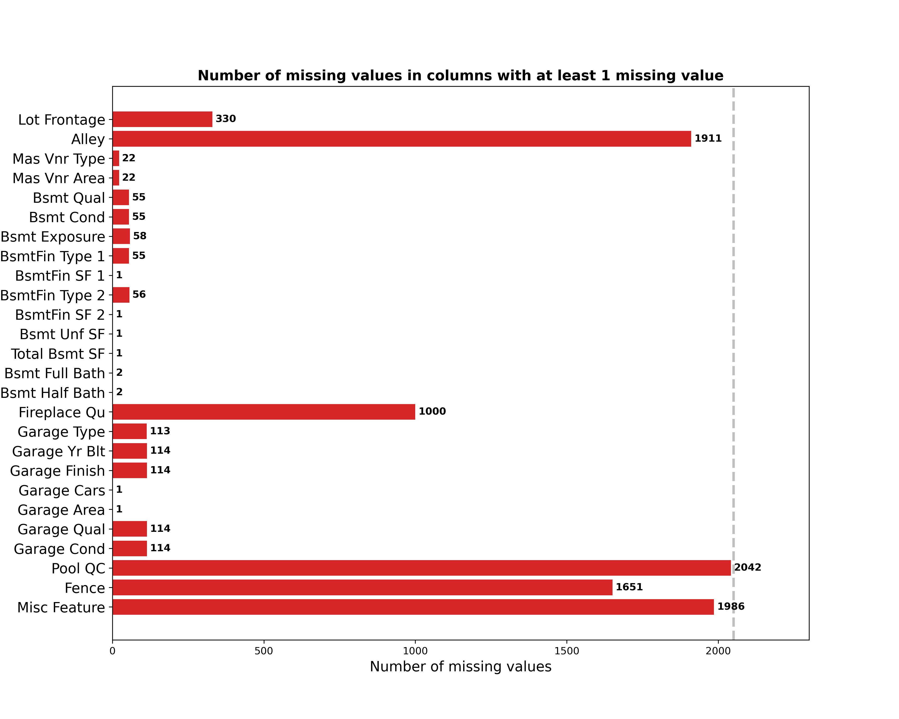
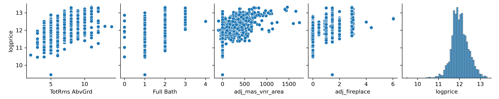

# Project 2 - Ames Housing Data and Kaggle Challenge

by Martijn de Vries  
martijndevries91@gmail.com

## Problem Statement

A real estate company in Ames, Iowa is looking for a new and improved way to evaluate the market value of a house. Using the Ames data set as training data, we will build a predictive linear regression model to predict the sale price of a house as well as possible.

To gauge the model performance, I will compare my results against a 'benchmark model', which is a simple OLS regression of total living area versus sale price. How much can a more complex model improve over this simple basic model? I will try out different models with different numbers of features using different linear regression techniques, and ultimately identify which model does the best job at predicting the market value of the house.

 
## Repository Overview
    
This repository consists of the following:

<ol>
   <li> The directory <code>./code</code> contains the four notebooks notebook used for this analysis. In data_cleaning.ipynb, I do basic EDA and data cleaning of the data, checking for missing values and doing imputations. In feature_engineering.ipynb, I take a closer look at the data, try to figure out which features could best be used to model the sale price, and build 'model input' files for increasingly complex models. The model input files can then be loaded in and used for modeling with minimal processing. In modeling.ipynb, I load in these model input files and use them to train a variety of models. I use the r2 score, the cross-validation score, and the RMSE to evaluate which model does the best job at predicting sale prices. In modeling_insights.ipynb, I hone in on the best model, evaluate them in more detail, and compare them against the benchmark model. </li>
   <li> The directory <code>./data</code> contains the input data csv files, train.csv and test.csv. It also includes the cleaned train and test data, as well as the Kaggle contest submission files, which consist of a set of housing IDs and predicted sale prices for those houses, using various models from the modeling notebook.
    <li> The directory <code>./model_inputs</code> contains the model input files constructed in feature_engineering.ipynb. These files can be loaded in and used to fit the model with minimal processing.
   <li> The directory <code>./figures</code> contains all the figures that are saved during the analysis in the notebooks, in .png formats </li>
    <li> The slides for the project presentation are in the file <code>project2_martijn_slides.pdf</code> </li>
</ol>

Below, I will provide a summary of the EDA, data cleaning, feature engineering, and modeling procedure. More details and figures can be found in each of the notebooks.

## Data Overview

For this project, I used the Ames housing data set, which was pre-split into a train and test data set. The training set consists of 2051 houses and 81 columns, including the sale price. The test set consists of 878 houses, and has the exact same columns exluding the sale price column. The data consists of both numerical columns (eg. the square footage of the land, the number of bathrooms, or the number of fireplaces), and categorical columns (eg. is there a pool, what kind of garage is there, does the property have a fence). 

Two important resources describing the Ames data set are :  
The original paper (De Cock 2011): https://jse.amstat.org/v19n3/decock.pdf  
The data description/dictionary: https://jse.amstat.org/v19n3/decock/DataDocumentation.txt

The figure below shows a histogram of the target variable, the sale price

We can already see that the distribution is pretty right-skewed!

## Data Cleaning

After general inspection of the data, we looked at missing values. The image below shows all the columns in the training set in which missing values were detected. The grey line shows the total number of rows in the training set.

The missing values can be defined into a few different categories, which I dealt with in different ways:

<ol>
    <li> A few of the columns have 'NA' (Not applicable) as a category. Eg. for the 'Alley' column, some houses do not have an Alley and thus have 'NA' filled in. Pandas erroneously interprets this as a NaN when loading in the data. In these cases, I simply imputed the value 'NP' (Not present) </li>
    <li> There were a few numerical columns that were directly related to the above columns - eg some houses in which a garage was not present, had a missing value for the 'Garage Area' column. In those cases, it made logical sense to impute a value of zero. This was also the case for some columns related to the basement, and the Masonry veneer. </li>
    <li> The 'Lot frontage' column represented a special case. Around 15% of houses have missing entries, which is quite significant. The value here is not likely to be zero from a logical standpoint, as houses are typically required/expected to have street access. What I did instead was to make the assumption that a property is roughly square, and will have frontage on one side. The Lot frontage should therefore be proportional to the square root of the lot area. I tested this assumption and it seems that this holds up roughly speaking, if we subtract some constant. I used this equation to impute the missing Lot frontage value</li>
    <li> For all the remaining missing values, I imputed the mode (if categorical) or the median (if numerical). These imputations were typically only 1 or 2 rows for each category, so they will likely have a minor effect </li>
</ol>

I put all of the above imputations, together with some other minor cleaning steps (filtering out a few outliers, recasting a handful of columns to other datatypes) into a function called clean_ames(), so that both the testing and training dataset are cleaned in the exact same manner.

## Feature Engineering and Preprocessing

To start with, I looked at which numerical columns have a high correlation with sale price. This can be seen in the Figure below.

Using this correlation heatmap together with further analysis, I selected features that seemed most likely to be good predictors of the sale price. I then constructed four models of increasing complexity.

### Model 1

I combined the 'Gr Liv Area' (above grade living area, in square feet) and 'Tot Bsmt SF' (Basement living area, in square feet) into a new feature: tot_area. This indicates the total living area of the house. I also included 'Overall Qual' (the quality rating of the house) into the model, as well as the year it was built and the year the house was remodeled/added to. One thing to note is that for the build year and remodeling year, the relationship to the target variable (Sale price) seems much more linear if I take the log of the sale price.

Additionally, for certain features I attempted to calculate 'adjusted values'. For model 1, in the above heatmap I noticed that the 'Garage Area' correlated well with Sale Price. But, because I'm assuming that a single square foot of garage of an garage rated 'excellent' might count for more than from a garage rated 'poor', I adjust the garage area based on both the garage rating and the style of the garage.

Finally, for model 1 I also added the MS Zoning code and the Home functionality as categorical variables, which I turned into dummy variables. The figure below shows the correlation between the numerical columns in model 1 and the log the sale price.

### Model 2

For model 2, I added the total number of rooms aboveground, the number of bathrooms without any further processing. I also made adjusted columns for the number of fireplaces (adjusted by the fireplace quality) and the the masonry veneer area (adjusted by the type of veneer). Finally, I added another categorical location feature using the 'Neighborhood' column. The pair plot below shows the relationship of the new numerical features to the log of the sale price.

### Model 3

For model 3, I tested the validity of my 'adjusted' parameters. The number of features is the same as in model 2, but instead of using adjusted garage area, adjusted masonry veneer area, and adjusted number of fireplaces.

### Model 4

Finally, for my most complex model, I used the same features as Model 3 but added a bunch of extra features. I added 3 numerical columns: the Lot Frontage, the number of cars that fit into the garage, and the overall condition rating of the house. I also added a number of extra categorical features, namely the Basement Quality, whether the house has Central Airconditioning or not, whether the house has an alley or not, and what kind of Driveway there is. Finally, I added the Yr Sold as a categorical variable. Since this data set is from between 2006 and 2010, I figured that the 2008 financial crisis might have affected the sale prices for some years. The figure below again shows the relationship between the log of the price and the added numerical columns

## Modeling

For each of the tested models, I split the data into a training set and a 'validation' set (to not get confused with the test set, which is the data we do <i>not</i> have the sale price for). I then trained the model on the training data, and calculated the R2-score on both the training and validation data. I also calculated the cross-validation score on the training data, as well as the root mean squared error (RMSE) on both the training and validation data. I tested out all the models above, but will only highlight the benchmark model and the most succesful model (model 4) here.

### Benchmark Model

As the Benchmark model, I used a simple OLS regression, using 'tot_area' as the single feature and the sale price as the predictor variable. This model already performs decently by itself: the r2-scores on the training and validation data are 0.69 and 0.64, respectively, indicating that 64% of the variance of the model can be explained by the tot_area parameter. The validation RMSE is \$47000. These are the benchmarks I compare the model against.

### Model 4

## Data Dictionary 

A data dictionary of the features used in the most succesful model, (model 4). All features are from the Ames housing data set - 'Feature engineered' indicates that additional processing was done to the columns before inputting them into the model. The triple asterisk indicates dummy features (eg. for Basement Quality, there is a 'Bsmt Qual_Po', 'Bsmt Qual_Ex', etc).

|Feature|Type|Dataset|Description|Encoding Info|
|---|---|---|---|---|
|ID | int | Ames data | ***Primary Key***-The house ID in the Ames housing data set || 
|tot_area | float | Feature Engineered | The total living area in square feet|Sum of above-grade SF and basement SF|
|gar_area| float | Ames data | the Garage area in square feet ||
|lot_frontage | float | Ames data | the total amount of lot frontage in linear feet| 
|yr_built | int | Ames data | the year the house was built | |
|yr_remod | int | Ames data | the year the house was remodeled or added to | |
|qual | int | Ames data | The overall quality rating of the house | rated 1-10|
|tot_rooms_abv | int | Ames data | The total number of rooms above ground | |
|full_bath | int | Ames data | the total number of bathrooms | |
|mas_vnr_area | float | Ames data | the total surface area of masonry veneer  | |
|fireplaces | int | Ames data | the total number of fireplaces ||
|cond | int | Ames data | The overall condiiton rating of the house  | rated 1-10|| 
|gar_cars | int | Ames data | The number of cars that fit into the garage ||
|cond_\*\*\* | category | Feature engineered | Special conditions that apply to the house | Dummified: 'Typ' rating is baseline |
|MS Zoning_\*\*\* | category | Feature enginereed | Zoning code for the house (eg Residential, industrial) | Dummified: 'RL' is the baseline
|Func_\*\*\*  | category | Feature engineered | Functionality for the house (eg. deductions, salvage) | Dummified: 'Typ' is the baseline
|Neighborhood_\*\*\* | category | Feature engineered | Neighborhood | Dummified: 'NAmes' is the baseline |
|Kitchen Qual_\*\*\* | category | Feature engineered | Quality rating of the kitchen (good, poor, fair, etc) |  Dummified: 'TA' is the baseline
|Bsmt Qual_\*\*\* | category | Feature engineered | Quality rating of the basement (good, poor, fair, etc) |  Dummified: 'TA' is the baseline
|Central Air_\*\*\* | category | Feature engineered | Whether the house has central air conditioning or not |  Dummified: 'Y' is the baseline
|Alley_\*\*\* | category | Feature engineered | Whether the house has an alley and what type |  Dummified: 'NP' is the baseline
|Paved Drive_\*\*\* | category | Feature engineered | Is there a paved driveway |  Dummified: 'Y' is the baseline
|Yr Sold_\*\*\* | category | Feature engineered | Year the house was sold |  Dummified: '2006' is the baseline
|Saleprice | int |Ames data | ***Target variable***-the sale price in dollars | I use log(Saleprice) in the actual regression |

## Conclusions

In this project, I've built a predictive linear regression model to predict the sale price of houses in Ames, Iowa using the Ames dataset.

After basic EDA and data cleaning (imputing values as appropriate, and removing a handful of rows), I constructed several different models of increasing complexity. The best-performing model is the most complex of the models I've constructed, consisting of 12 numerical features and 10 (dummified) categorical features. I did find that adding even more features to some extent leads to diminishing returns, in that the R2-value and root mean squared error (RMSE) of my most complex model was only modestly better than the model one step lower in complexity.

OLS and Ridge regressors performed very similar, but it seems that the Ridge regression does slightly better overall. The fact that a Ridge model only improves slightly over OLS indicates that my model is not high in variance. The model works well for predictive purposes, significantly improving over the baseline model (a simple least squares regression using total living area as the only feature). In terms of the R2-score, the features in the more complex model can explain 88% of the variance (vs 63% for the baseline), and the RMSE reduces from 47000 to 22100 dollars. This model can therefore be succesfully used to model the market value of houses in Ames, Iowa. One caveat is that the model would have to be retrained as new data comes in to keep up-to-date with the 'Year Sold' columns, as this is a categorical feature. The model also only applies to houses in Ames, Iowa, given the location-specific feature of Neighborhood. This model could serve as a template for similar models in other locations, but it would need local data to really have predictive power.

The model could likely be improved even more with better feature engineering: a more detailed analysis of which features should be included, and/or smarter encoding of categorical features could reduce the model complexity while still retaining the same level of predictive power. The scope of this project was limited to Linear Regression, but other type of regressions might improve the model performance well.