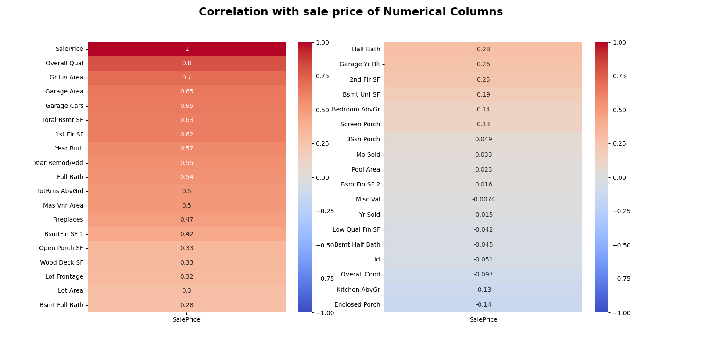

# Project 2 - Ames Housing Data and Kaggle Challenge

by Martijn de Vries  
martijndevries91@gmail.com

## Problem Statement

A real estate company in Ames, Iowa is looking for a new and improved way to evaluate the market value of a house. Using the Ames data set as training data, we will build a predictive linear regression model to predict the sale price of a house as well as possible.

To gauge the model performance, I will compare my results against a 'benchmark model', which is a simple OLS regression of total living area versus sale price. How much can a more complex model improve over this simple basic model? I will try out different models with different numbers of features using different linear regression techniques, and ultimately identify which model does the best job at predicting the market value of the house.

 
## Repository Overview
    
This repository consists of the following:

<ol>
   <li> The directory <code>./code</code> contains the four notebooks notebook used for this analysis. In data_cleaning.ipynb, I do basic EDA and data cleaning of the data, checking for missing values and doing imputations. In feature_engineering.ipynb, I take a closer look at the data, try to figure out which features could best be used to model the sale price, and build 'model input' files for increasingly complex models. The model input files can be used for modeling with minimal processing. In modeling.ipynb, I load in these model input files and use them to build a variety of models. I use the r2 score, the cross-validation score, and the RMSE to evaluate which model does the best job at predicting sale prices. In modeling_insights.ipynb, I hone in on the best model(s), evaluate them in more detail, and compare them against the benchmark model. </li>
   <li> The directory <code>./data</code> contains the input data csv files, train.csv and test.csv. It also includes the cleaned train and test data, as well as the Kaggle contest submission files, which consist of a set of housing IDs and predicted sale prices for those houses, using various models from the modeling notebook.
    <li> The directory <code>./model_inputs</code> contains the model input files constructed in feature_engineering.ipynb. These files can be loaded in and used to fit the model with minimal processing.
   <li> The directory <code>./figures</code> contains all the figures that are made during the analysis in the notebooks, in .png formats </li>
    <li> The slides for the project presentation are in the file <code>project2_martijn_slides.pdf</code> </li>
</ol>

Below, I will provide a summary of the EDA, data cleaning, feature engineering, and modeling procedure. More details and figures can be found in each of the notebooks.

## Data Overview

For this project, I used the Ames housing data set, which was pre-split into a train and test data set. The training set consists of 2051 houses and 81 columns, including the sale price. The test set consists of 878 houses, and has the exact same columns exluding the sale price column. The data consists of both numerical columns (eg. the square footage of the land, the number of bathrooms, or the number of fireplaces), and categorical columns (eg. is there a pool, what kind of garage is there, does the property have a fence). 

Two important resources describing the Ames data set are :  
The original paper (De Cock 2011): https://jse.amstat.org/v19n3/decock.pdf  
The data description/dictionary: https://jse.amstat.org/v19n3/decock/DataDocumentation.txt

The figure below shows a histogram of the target variable, the sale price

We can already see that the distribution is pretty right-skewed!

## Data Cleaning

After general inspection of the data, we looked at missing values. The image below shows all the columns in the training set in which missing values were detected. The grey line shows the total number of rows in the training set.

The missing values can be defined into a few different categories, which I dealt with in different ways:

<ol>
    <li> A few of the columns have 'NA' (Not applicable) as a category. Eg. for the 'Alley' column, some houses do not have an Alley and thus have 'NA' filled in. Pandas erroneously interprets this as a NaN when loading in the data. In these cases, I simply imputed the value 'NP' (Not present) </li>
    <li> There were a few numerical columns that were directly related to the above columns - eg some houses in which a garage was not present, had a missing value for the 'Garage Area' column. In those cases, it made logical sense to impute a value of zero. This was also the case for some columns related to the basement, and the Masonry veneer. </li>
    <li> The 'Lot frontage' column represented a special case. Around 15% of houses have missing entries, which is quite significant. The value here is not likely to be zero from a logical standpoint, as houses are typically required/expected to have street access. What I did instead was to make the assumption that a property is roughly square, and will have frontage on one side. The Lot frontage should therefore be proportional to the square root of the lot area. I tested this assumption and it seems that this holds up roughly speaking, if we subtract some constant. I used this equation to impute the missing Lot frontage value</li>
    <li> For all the remaining missing values, I imputed the mode (if categorical) or the median (if numerical). These imputations were typically only 1 or 2 rows for each category, so they will likely have a minor effect </li>
</ol>

I put all of the above imputations, together with some other minor cleaning steps (filtering out a few outliers, recasting a handful of columns to other datatypes) into a function called clean_ames(), so that both the testing and training dataset are cleaned in the exact same manner.

## Feature Engineering

To start with, I looked at which numerical columns have a high correlation with sale price. This can be seen in the Figure below.

### Model 1
I combined the 'Gr Liv Area' (above grade living area, in square feet) and 'Tot Bsmt SF' (Basement living area, in square feet) into a new feature: tot_area. This indicates the total living area of the house. I also included 'Overall Qual' (the quality rating of the house) into the model, as well as the year it was built and the year the house was remodeled/added to. One thing to note is that for the build year and remodeling year, the relationship to the target variable (Sale price) seems much more linear if I take the log of the sale price.

Additionally, for certain features I attempted to calculate 'adjusted values'. For model 1, in the above heatmap I noticed that the 'Garage Area' correlated well with Sale Price. But, because I'm assuming that a single square foot of garage of an garage rated 'excellent' might count for more than from a garage rated 'poor', I adjust the garage area based on both the garage rating and the style of the garage.

Finally, for model 1 I also added the MS Zoning code and the Home functionality as categorical variables, which I turned into dummy variables. The figure below shows the correlation between the numerical columns in model 1 and the log the sale price.

### Model 2